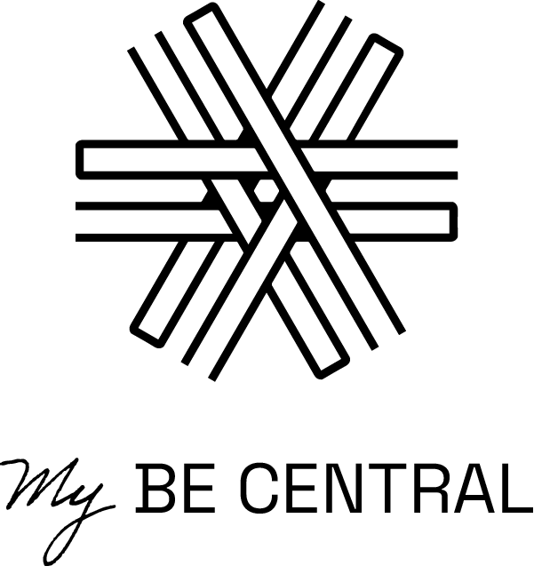

# MyBeCentral

## What is MyBeCentral?

BeCentral is THE tech central in Brussels. It would make sense that we have our own social network. We took that matter in our own hands, and made a platform where anyone from BeCentral can post something for the other residents. An event, a job opening, looking for an internship, a new product a startup released, … anything! It aims to be the place for campus' updates.

## So who did it?

We have three front-end developers: Chloé Halloin, Louise Vassart and Nicola Corradini. All three are students at BeCode.

## And how did they do that?

Using a combination of:

## What does it look like?

Like this:

